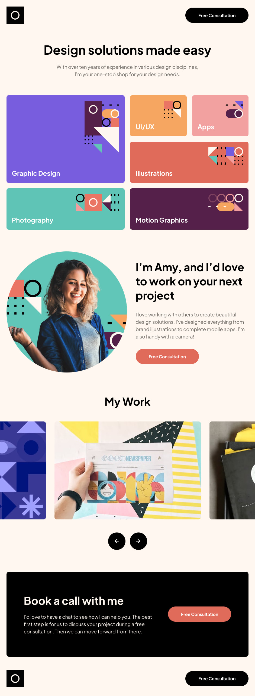

# Frontend Mentor - Single-page design portfolio solution

This is a solution to the [Single-page design portfolio challenge on Frontend Mentor](https://www.frontendmentor.io/challenges/singlepage-design-portfolio-2MMhyhfKVo). Frontend Mentor challenges help you improve your coding skills by building realistic projects.

## Table of contents

- [Overview](#overview)
  - [The challenge](#the-challenge)
  - [Screenshot](#screenshot)
  - [Links](#links)
- [My process](#my-process)
  - [Built with](#built-with)
  - [What I learned](#what-i-learned)
  - [Continued development](#continued-development)
  - [Useful resources](#useful-resources)
- [Author](#author)


## Overview

### The challenge

Users should be able to:

- View the optimal layout for the site depending on their device's screen size
- See hover states for all interactive elements on the page
- Navigate the slider using either their mouse/trackpad or keyboard

### Screenshot



### Links

- Solution URL: [Github](https://github.com/katrien-s/fe-26-005-single-page-design-portfolio)
- Live Site URL: [Add live site URL here](https://your-live-site-url.com)

## My process

### Built with

- Semantic HTML5 markup
- CSS custom properties
- Flexbox
- CSS Grid
- Mobile-first workflow
- SCSS

### What I learned

How to put the focus on a specific slider on page load:
```js
slides[currentIndex].scrollIntoView({
	inline: 'center',
	block: 'nearest',
	behavior: 'instant'
});
```

### Continued development

JavaScript keeps doing my head in. It's all there, it's all relatively simple, but I somehow seem to forget it all. More studybooks & practice.
As for SCSS, I need to rethink how I add my colourvariables to be more consistent with how variables work in SCSS.

### Useful resources

- [CSS Scroll Snapping Aligned With Global Page Layout: A Full-Width Slider Case Study](https://www.smashingmagazine.com/2023/12/css-scroll-snapping-aligned-global-page-layout-case-study/) Eventhough I eventually didn't use what's being written about in this article. I'm adding it to keep it for future projects. I did consider implementing it.

## Author

- Website - [Katrien S](https://www.katriens.be)
- Frontend Mentor - [@katrien-s](https://www.frontendmentor.io/profile/katrien-s)
